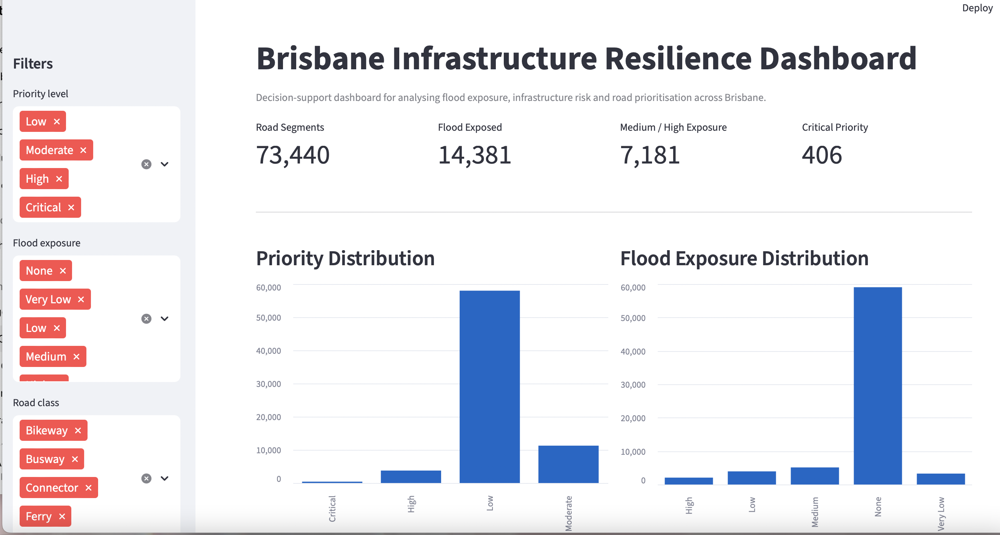
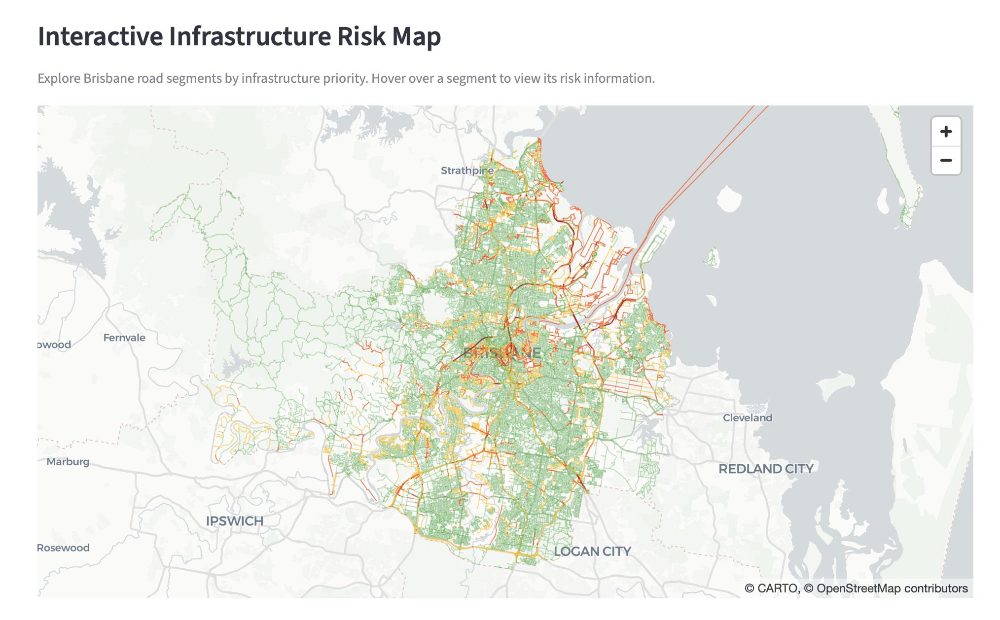
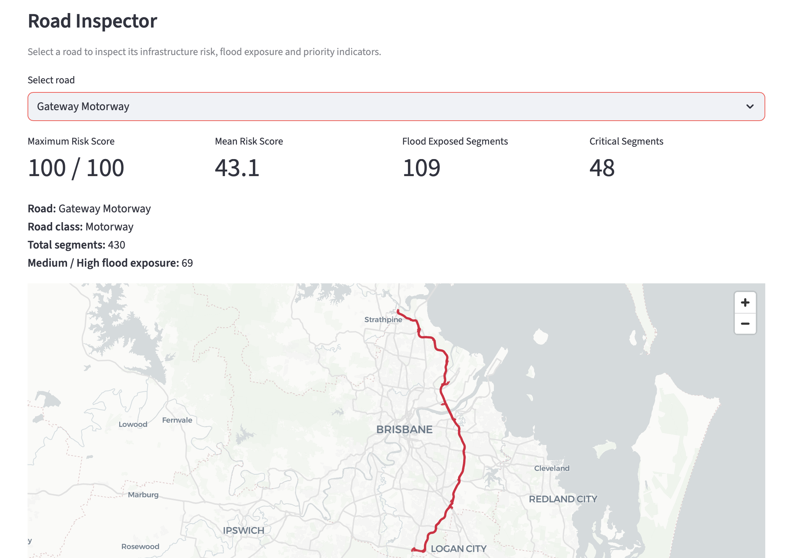
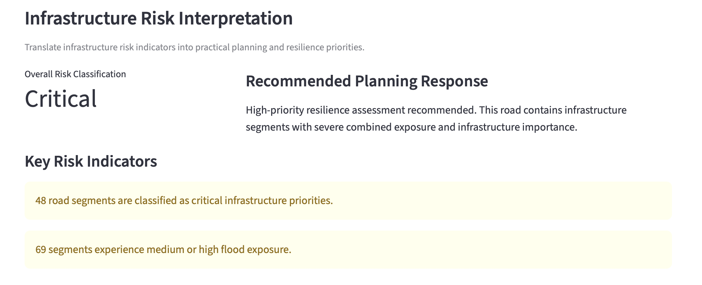
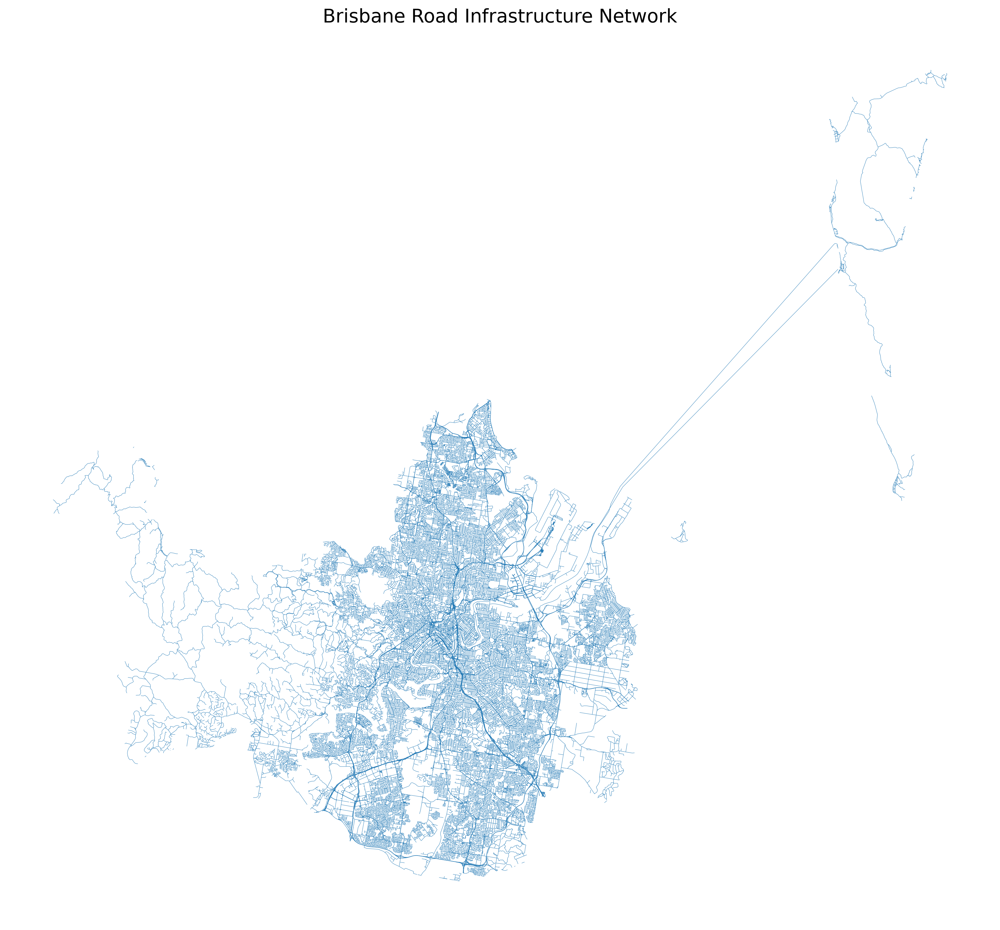
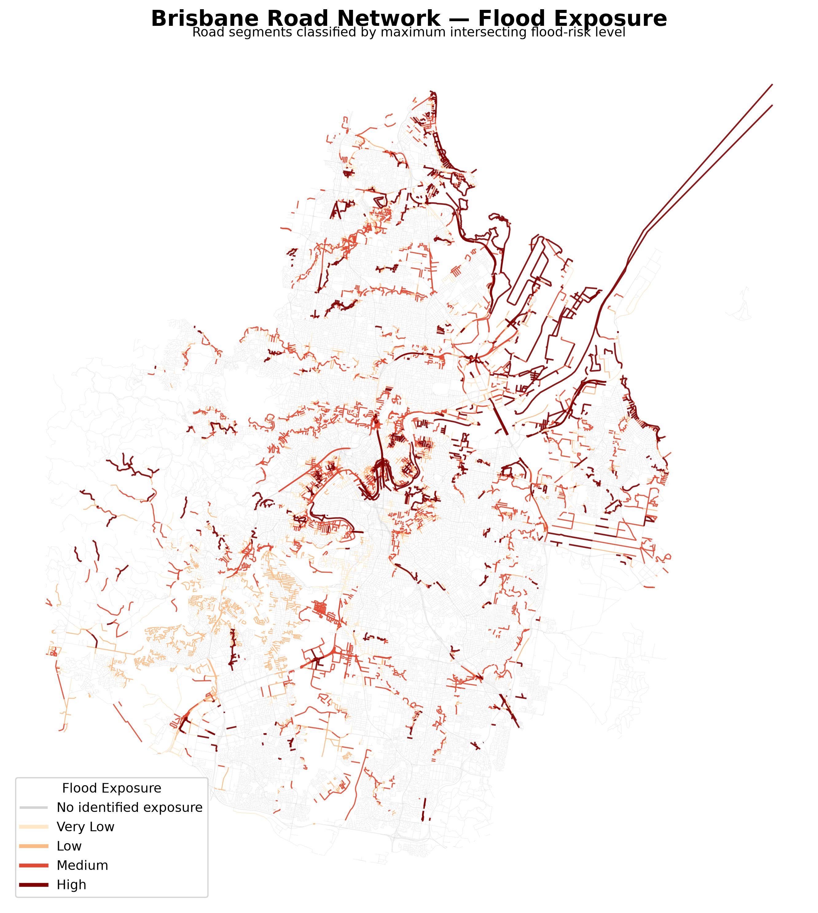
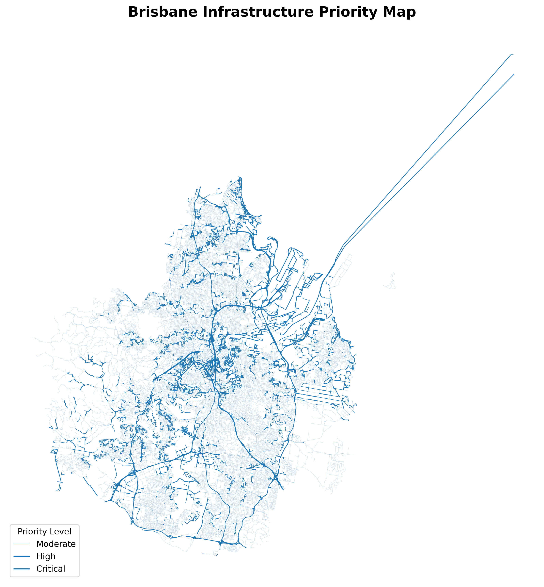

<div align="center">

# 🌉 Brisbane Infrastructure Resilience Platform

### Geospatial analytics for flood-resilient infrastructure planning

**An interactive decision-support platform that identifies flood-exposed road infrastructure, quantifies risk, and helps prioritise resilience investment across Brisbane.**

<br>


<br><br>

<a href="https://infrastructure-resilience-platform-w9uqhbjnpou3bxfreuei9x.streamlit.app">
  
</a>

<br><br>



</div>

---

## ✨ Overview

Flooding can disrupt critical transport infrastructure and affect the accessibility and resilience of an entire city.

This project combines **geospatial road-network data, flood exposure information and infrastructure characteristics** to identify vulnerable road segments across Brisbane.

The platform transforms raw spatial datasets into an interactive decision-support dashboard that allows users to:

- 🗺️ Explore infrastructure risk spatially
- 🌊 Identify flood-exposed road segments
- 📊 Compare infrastructure risk across Brisbane
- 🚨 Detect critical-priority infrastructure
- 🛣️ Inspect individual roads and their risk characteristics
- 🎯 Translate risk indicators into planning recommendations

---

## 📊 Brisbane Infrastructure at a Glance

| Metric | Result |
|:---|---:|
| 🛣️ Road segments analysed | **73,440** |
| 🌊 Flood-exposed segments | **14,381** |
| ⚠️ Medium / high flood exposure | **7,181** |
| 🚨 Critical-priority segments | **406** |

These results are generated from the processed geospatial dataset used by the dashboard.

---

## 🖥️ Interactive Dashboard

The Streamlit dashboard provides a single interface for exploring infrastructure resilience across Brisbane.

### 🌸 City-wide Risk Analysis

Users can dynamically filter infrastructure by:

- Priority level
- Flood exposure
- Road class

The dashboard automatically recalculates KPIs and distributions based on the selected infrastructure.

---

### 🗺️ Interactive Infrastructure Risk Map

Road segments are visualised geographically using **PyDeck**, allowing users to explore how infrastructure risk varies across Brisbane.

Priority categories provide a visual representation of where higher-risk infrastructure is concentrated.



---

### 🔍 Road Inspector

Individual roads can be selected for detailed investigation.

For each road, the platform calculates:

- Maximum risk score
- Mean risk score
- Number of flood-exposed segments
- Medium/high flood-exposure segments
- Critical-priority segments

The selected road is isolated on an interactive map so its spatial extent can be examined directly.



---

### 🎯 Infrastructure Risk Interpretation

The platform goes beyond displaying data by translating risk scores into planning-oriented interpretations.

Roads are classified into:

`Low` → `Moderate` → `High` → `Critical`

The dashboard then provides a corresponding resilience-planning response and highlights important risk indicators.



---

## 🧠 How It Works

```text
        Road Network Data
               │
               ▼
       Data Preparation
               │
               ▼
      Geospatial Processing
               │
               ▼
       Flood Exposure Analysis
               │
               ▼
       Infrastructure Scoring
               │
               ▼
         Risk Score (0–100)
               │
               ▼
      Priority Classification
               │
               ▼
     ┌──────────────────────┐
     │ Streamlit Dashboard  │
     └──────────────────────┘
          │            │
          ▼            ▼
    Risk Mapping   Road Inspector
          │            │
          └──────┬─────┘
                 ▼
          Decision Support
```

---

## ⚙️ Risk Analysis Pipeline

The analytical workflow is separated into several stages.

### 1. Road preparation

Raw Queensland road-network data is cleaned, filtered to the Brisbane area and transformed into an analysis-ready geospatial dataset.

### 2. Flood exposure analysis

Road geometries are spatially evaluated against Brisbane flood-risk polygons to determine whether each road segment intersects flood-prone areas.

### 3. Infrastructure risk calculation

Flood exposure, road importance and infrastructure characteristics are combined into a transparent heuristic score between **0 and 100**.

The current scoring model uses:

- **Flood exposure:** up to 50 points
- **Road importance:** up to 30 points
- **Infrastructure type:** up to 20 points

This produces a maximum risk score of:

```text
100
```

### 4. Priority classification

Infrastructure is grouped into four priority categories:

- 🟢 Low
- 🟡 Moderate
- 🟠 High
- 🔴 Critical

### 5. Road-level prioritisation

Individual road segments are aggregated by road name to produce road-level summaries including:

- Maximum risk score
- Mean risk score
- Total road segments
- Flood-exposed segments
- Medium/high exposure segments
- Critical-priority segments

### 6. Decision support

Results are exposed through interactive maps, road rankings, individual road inspection and planning-oriented risk interpretations.

> **Note:** The risk score is a transparent decision-support heuristic rather than a validated engineering failure model. It is designed to demonstrate geospatial risk prioritisation and should not be interpreted as a substitute for detailed engineering assessment.

---

## 🛣️ Example Priority Infrastructure

The analysis highlights major infrastructure corridors including:

- Gateway Motorway
- Port of Brisbane Motorway
- Pacific Motorway
- Centenary Motorway
- Clem7
- Airport Link
- Southern Cross Way
- Bradfield Highway

These roads rank highly because they contain combinations of significant infrastructure, major road classifications and flood-exposed segments.

---

## 🌍 Geospatial Outputs

The project also generates static geospatial outputs during the analysis pipeline.

### Brisbane Road Network



### Flood Exposure



### Infrastructure Priority



---

## 🛠️ Tech Stack

| Area | Technology |
|---|---|
| 🐍 Programming | Python |
| 🌍 Geospatial analysis | GeoPandas |
| 📐 Spatial geometry | Shapely |
| 🧮 Data processing | Pandas, NumPy |
| 🗺️ Interactive mapping | PyDeck |
| 📊 Dashboard | Streamlit |
| 📈 Visualisation | Matplotlib |
| 🤖 Data science | Scikit-learn |
| 📓 Exploration | Jupyter |
| 🔧 Version control | Git & GitHub |

---

## 📁 Project Structure

```text
infrastructure-resilience-platform/
│
├── dashboard/
│   └── app.py
│
├── data/
│   ├── raw/
│   └── processed/
│
├── docs/
│   └── images/
│       ├── dashboard_overview.png
│       ├── dashboard_risk_map.png
│       ├── road_inspector.png
│       ├── decision_support.png
│       ├── brisbane_road_network.png
│       ├── brisbane_flood_risk_roads.png
│       └── brisbane_infrastructure_priority.png
│
├── notebooks/
│
├── src/
│   ├── prepare_roads.py
│   ├── analyse_flood_risk.py
│   ├── calculate_risk.py
│   ├── summarise_risk.py
│   ├── visualize_roads.py
│   ├── visualize_flood_risk.py
│   └── visualize_priority.py
│
├── tests/
│
├── requirements.txt
├── README.md
└── LICENSE
```

---

## 🚀 Running the Dashboard

### 1. Clone the repository

```bash
git clone <repository-url>
cd infrastructure-resilience-platform
```

### 2. Create a virtual environment

```bash
python -m venv .venv
source .venv/bin/activate
```

### 3. Install dependencies

```bash
pip install -r requirements.txt
```

### 4. Launch the dashboard

```bash
streamlit run dashboard/app.py
```

Then open the local Streamlit address shown in the terminal.

---

## 💡 Why I Built This

Infrastructure resilience problems sit at the intersection of **data science, geospatial analytics and engineering decision-making**.

Rather than building a dashboard around an already-clean dataset, this project focuses on the complete analytical workflow:

**raw spatial data → geospatial processing → exposure analysis → risk scoring → visualisation → decision support**

The aim is to demonstrate how geospatial data can be transformed into information that supports practical infrastructure planning.

---

## ⚠️ Limitations

This project is currently a portfolio-scale decision-support prototype.

Important limitations include:

- The risk model is heuristic rather than calibrated against real infrastructure failure or maintenance records.
- Flood exposure is based on spatial intersection with flood-risk polygons and does not model flood depth, duration or velocity.
- Several road attributes contain missing or unknown values and were excluded from the scoring model where appropriate.
- The current platform focuses on flood exposure rather than multiple climate hazards.
- Risk scores should be interpreted as prioritisation indicators rather than engineering conclusions.

---

## 🔮 Future Development

Planned extensions include:

- 🌧️ Integration of additional climate hazards
- 📍 Suburb and local-government-area analysis
- 💰 Infrastructure investment prioritisation
- 📈 Scenario-based risk comparison
- 🧪 Expanded validation of the risk-scoring methodology
- 🗄️ PostgreSQL / PostGIS integration
- 🔌 API layer for infrastructure analytics
- 🐳 Docker containerisation
- 🧪 Automated testing and CI/CD
- ☁️ Public deployment of the dashboard

---

<div align="center">

### 🌸 Data Science × Geospatial Analytics × Infrastructure Resilience

Built with Python, GeoPandas, PyDeck and Streamlit.

</div>